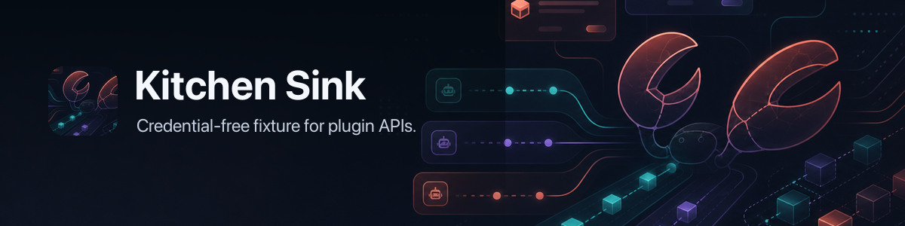

# 🧽 OpenClaw Kitchen Sink Plugin



Credential-free OpenClaw plugin fixture that intentionally touches the public
plugin API surface and works as a kitchen sink boilerplate for plugin authors.

This repo is both:

- a readable example for plugin authors
- a dummy compatibility fixture for [Crabpot](https://github.com/openclaw/crabpot) and [plugin-inspector](https://github.com/openclaw/plugin-inspector)
- a live plugin `@openclaw/kitchen-sink` that can be installed via clawhub and npm for testing features

The generated runtime probes are credential-free. The hand-owned Kitchen Sink
runtime also registers deterministic direct commands, tools, image generation,
speech, realtime transcription/voice, video, music, media understanding, web
search, web fetch, memory, compaction, gateway/service/CLI, channel, hook,
detached-task, and text-provider catalog surfaces.
It should not call external services, read secrets, spawn processes, or require
live credentials.

The plugin exposes three test personalities through
`plugins.entries.openclaw-kitchen-sink-fixture.config.personality`:

- `full` is the default compatibility mode and keeps both generated probe
  registrations and the hand-owned runtime.
- `conformance` loads only the valid runtime surfaces and skips intentionally
  invalid probes so OpenClaw can assert a clean external-plugin install.
- `adversarial` loads only generated invalid probes so OpenClaw can assert
  expected diagnostics without mixing them with a live runtime smoke.

## Source Layout

The hand-owned runtime is intentionally split by plugin surface so it can be
used as reference code instead of one giant fixture file:

- `src/index.js` selects the Kitchen Sink personality and registers the runtime
  plus generated probes.
- `src/kitchen-runtime.js` is the runtime registrar entrypoint. It wires
  builders together but keeps the implementation in smaller modules.
- `src/runtime/commands.js`, `channel.js`, `providers.js`, `tasks.js`, and
  `platform.js` hold the command/tool, channel, provider, detached-task, and
  service/gateway/CLI registrations.
- `src/scenarios.js` is the deterministic scenario router shared by dry
  commands, tools, providers, hooks, channel delivery, and tests.
- `src/fixtures/` holds deterministic mock payloads such as the bundled image
  asset and text-provider stream fixture.
- `src/generated-*` files are diagnostic surface probes generated from the
  installed OpenClaw SDK. They are not the code plugin authors should copy.
- `scripts/lib/` holds test harness code reused by runtime and contract probes;
  `scripts/fixtures/` holds reviewable consumer-smoke programs.

## Kitchen Runtime

The fixture can be used dry, without an LLM:

```text
kitchen image generate a kitchen sink
kitchen image rate limit
kitchen image timeout
kitchen search kitchen sink provider routing
kitchen fetch kitchen://fixture/redirect
kitchen explain the fixture
```

It also exposes provider and tool surfaces for live model routing:

- `listKitchenHumanScenarios()` and `runKitchenHumanScenario(runtime, id)`
  provide deterministic end-to-end user scenarios for fixture consumers:
  `dry.prefix-image`, `live.openai-text-kitchen-image`,
  `search.fetch.summarize`, `channel.prefix-image`, `hook.block-tool`, and
  `memory.compact-fixture`.
- When a live text provider such as OpenAI is active and Kitchen Sink is
  selected as the image provider, the `live.openai-text-kitchen-image` scenario
  proves the human prompt can route to the Kitchen Sink image provider and
  return the bundled `kitchen_sink_office.png` asset without external image
  credentials.
- The `hook.block-tool` scenario proves terminal `before_tool_call` blocking,
  and the contract probe script also checks the approval path and conversation
  privacy observations for `llm_input`, `llm_output`, and `agent_end`.

- `src/scenarios.js` routes deterministic user scenarios; reusable mock payloads
  live in `src/fixtures/`.
- `kitchen_sink_image_job` returns a deterministic image job, waits 10 seconds
  in real runtime execution, then returns the bundled `kitchen_sink_office.png`
  image payload with PNG dimensions, byte size, SHA-256 hash, seed, model, and
  finish metadata.
- `kitchen-sink-image` is a registered image generation provider with aliases
  `kitchen`, `kitchen-sink`, and `openclaw-kitchen-sink`; prompts containing
  `rate limit`, `timeout`, or `fail` exercise deterministic provider error
  paths.
- `kitchen-sink-media` describes images with deterministic fixture text.
- `kitchen-sink-speech`, `kitchen-sink-realtime-transcription`,
  `kitchen-sink-realtime-voice`, `kitchen-sink-video`, and
  `kitchen-sink-music` expose credential-free media provider fixtures with
  deterministic WAV, transcript, bridge, storyboard, and track payloads.
- `kitchen-sink-search` and `kitchen-sink-fetch` provide credential-free web
  tool fixtures with realistic status codes, request ids, result metadata,
  redirects, headers, cache metadata, links, and markdown content.
- `kitchen-sink-embedding`, `kitchen-sink-memory-corpus`, and
  `kitchen-sink-compaction` provide deterministic memory vectors, corpus
  results, reads, and transcript summaries.
- `kitchen-sink-channel` is a credential-free channel fixture that can resolve
  local ready/disabled/misconfigured accounts, route outbound sessions, and
  deliver deterministic text/media records.
- `kitchen.status`, `/kitchen-sink/status`, `kitchen-sink-service`, and the
  lazy CLI descriptor exercise gateway method, HTTP route, service, and CLI
  registration surfaces.
- `kitchen-sink-llm` exposes a deterministic text-provider catalog row,
  provider-owned stream function, and prompt guidance so live LLM providers can
  discover the Kitchen Sink routes; responses describe which real plugin
  surface would handle image, search, fetch, and failure prompts.
- `kitchen-sink-embedding` exercises the current generic embedding adapter
  contract used by memory and search callers.
- generated hooks classify Kitchen Sink prompts, tool calls, and provider
  selections into shared scenario ids such as `image.generate`, `web.search`,
  and `text.reply`.
- the detached-task runtime records queued/running/completed/cancelled task
  transitions in memory so async OpenClaw task surfaces can be smoke-tested.

## API Surface Sync

The generated fixture is derived from the exact dev-pinned `openclaw` package.
The published plugin declares that host as an optional peer: npm does not
install another OpenClaw runtime, while the OpenClaw installer links the active
host into the plugin's module graph. It extracts the public
`openclaw/plugin-sdk/*` surface from:

- registrar methods
- hook names
- manifest contract fields
- exported plugin SDK subpaths

It then writes explicit static evidence for those surfaces: hook registrations,
registrar calls with no-op callback payloads, SDK import coverage, and manifest
contract coverage.

```sh
npm install
npm run sync:surface
npm run check:runtime
npm run check:inspector
npm run check:install
npm run pack:check
npm run pack:zip
```

The `Update OpenClaw SDK Surface` workflow automatically checks
`openclaw@latest` and `@openclaw/plugin-inspector@latest` every 10 minutes. When
either package changes, it regenerates the pinned dependency, lockfile,
manifest, hooks, registrars, and SDK import fixture files, runs the static and
runtime plugin-inspector checks, then creates and squash-merges its own
automation PR after those checks pass.

Dependabot still watches npm dependencies, but ignores `openclaw` and
`@openclaw/plugin-inspector` because those updates should flow through the
generated updater instead of package-only bump PRs.

## Publishing

Tagged GitHub releases publish the validated package to npm through trusted
publishing. The release tag must match `package.json`, for example `v0.0.1` for
version `0.0.1`.

`npm pack` remains the canonical npm artifact. `npm run pack:zip` builds the
legacy archive artifact at `dist/openclaw-kitchen-sink-fixture-<version>.zip`
with `package.json`, `openclaw.plugin.json`, `plugin-inspector.config.json`,
`README.md`, and `src/**` at the archive root for old archive installers.

Use the `Draft Release` workflow to create the tag and generated GitHub release
notes. Publishing that draft release runs the npm publish workflow. `0.0.x`
verification releases publish under the `verification` npm dist-tag so they do
not replace the stable `latest` tag.

Pull requests run a ClawHub package-publish dry run through the canonical
`openclaw/clawhub` reusable workflow on `main`, so the fixture tests the current
ClawHub publishing path instead of a vendored copy. Releases publish to ClawHub
through the same canonical workflow after validation.
